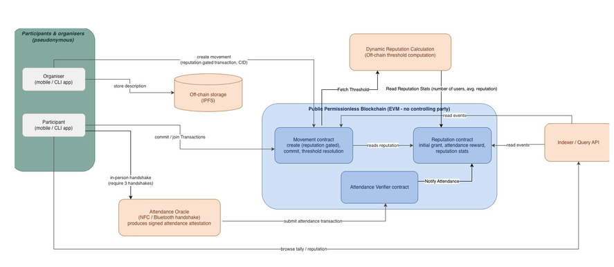

# Trustless Action Platform — COMP6452

Trustless attendance for on-chain "movements" (collective actions). Nobody self-reports
attendance — you prove it by mutually signing an EIP-712 handshake with the peers physically
next to you, and a contract verifies the proofs before crediting reputation.

## How it fits together

- **Contracts** are the source of truth. Everything else is a cache, a helper, or a keeper.
- **IPFS** holds the movement's actual content (title, description, images) — the chain only ever
  stores the resulting CID. `createMovement(threshold, deadlineDays, cid)` takes that CID; the
  frontend uploads to Pinata first (`frontend/.../lib/ipfs.ts`) and passes the CID it gets back.
- **Indexer** polls contract events into SQLite so the frontend isn't hammering the RPC node for lists.
- **Simulator** stands in for real peer devices during a demo — it holds local dev keys and builds
  the EIP-712 handshake proofs a real participant's wallet would produce. `AttendanceVerifier`
  requires 3 distinct peer handshakes before it'll credit attendance (`MIN_REQUIRED_PEER_COUNT`).
- **Dynamic Threshold** is the one off-chain piece that *writes* to a contract. It computes a
  reputation-based threshold for creating a movement and pushes it on-chain.

## Contracts

| Contract | What it does | Docs |
|---|---|---|
| `Reputation.sol` | Non-transferable, on-chain reputation. Initial grant on registration, reward per verified attendance. | [`docs/README-reputation.md`](docs/README-reputation.md), [`docs/reputation-events.md`](docs/reputation-events.md) |
| `Movement.sol` | Create/commit/resolve a movement. Gates `createMovement` behind a reputation threshold (`createRequirement`), settable only by the `requirementUpdater` (the backend keeper's wallet). | [`docs/README-movement.md`](docs/README-movement.md) |
| `AttendanceVerifier.sol` | Verifies a participant's mutually-signed handshake proofs against their peers and calls `Reputation.rewardAttendance`. | [`docs/README-attendance-verifier.md`](docs/README-attendance-verifier.md) |

## Services

| Service | Purpose | Docs |
|---|---|---|
| `services/indexer` | Polls contract events into SQLite, serves read-only HTTP APIs for the frontend. | [`services/indexer/README.md`](services/indexer/README.md) |
| `services/simulator` | Builds/signs handshake proofs for the 20 default Hardhat accounts, for demo purposes. | — |
| `backend/trustless-action-platform` | FastAPI keeper — computes the dynamic create-movement threshold and pushes it on-chain. | [`backend/trustless-action-platform/readme.md`](backend/trustless-action-platform/readme.md) |
| `shared/` | TypeScript reused across Hardhat tests, the simulator, and the indexer (EIP-712 helpers, HTTP helpers). | [`shared/readme.md`](shared/readme.md) |
| `frontend/trustless-action-platform` | React + wagmi UI. | [`frontend/trustless-action-platform/README.md`](frontend/trustless-action-platform/README.md) |
| IPFS (Pinata) | External — stores each movement's title/description/images; the chain only stores the CID. Not part of this repo, needs `VITE_PINATA_JWT`. | [`frontend/.../lib/ipfs.ts`](frontend/trustless-action-platform/src/lib/ipfs.ts) |
